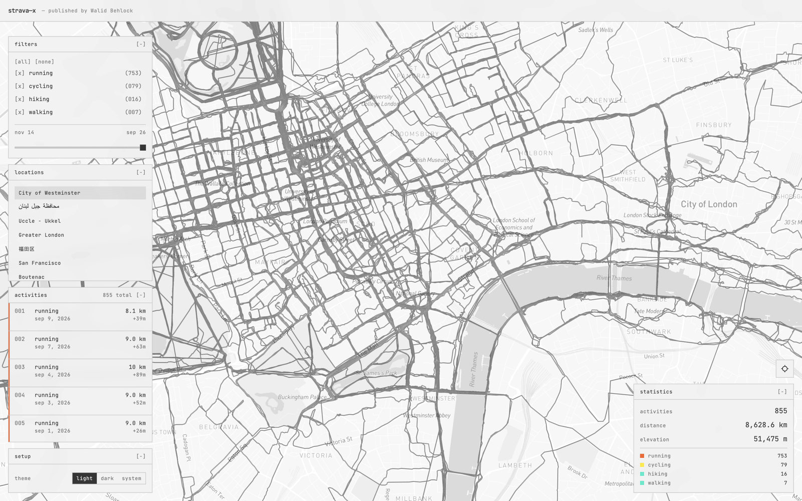

# strava-x

A spatial view of your Strava history.

strava-x puts your runs and rides on a single interactive map, making it easy to see where you've been, how your routes overlap, and which parts of a city you've explored.

## Features

- View your Strava activities on one map
- Explore runs and rides spatially
- Inspect individual activities
- See overlapping routes and patterns
